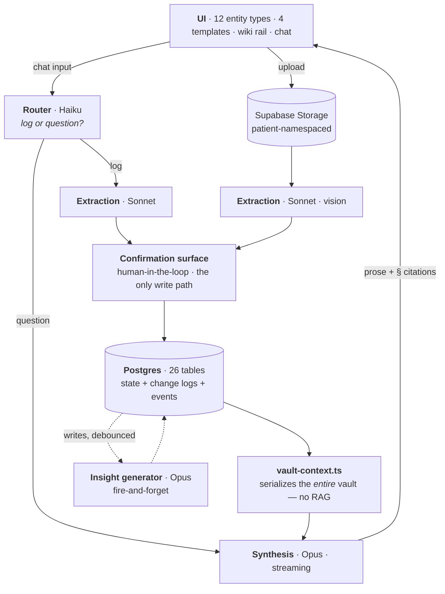

# arogya
<sub>*arogya* (आरोग्य) — Sanskrit for health, wholeness; literally "absence of disease."</sub>

**A personal health knowledge base for families managing an aging parent's or grandparent's care from another country.**

A structured, fully-traceable medical record — the *vault* — paired with a multi-agent AI layer that reasons across the entire record to surface cross-doctor patterns, medication–symptom correlations, care gaps, and questions worth raising at the next appointment. Every AI claim cites the record it came from.

<sub>Next.js 16 · React 19 · TypeScript (strict) · Postgres + Drizzle · Supabase · Anthropic API · Tailwind 4</sub>

---

## The problem

My grandparents are 75+ and live in India.

Between them they see a cardiologist, an ophthalmologist, an orthopedist, a GP, and whichever specialist a new complaint calls for — none of whom share a record system. A consultation runs three to five minutes. What connects those doctors is a plastic folder of paper lab reports and my grandparents' memory during the appointment.

My grandfather had episodic dizziness on standing for two years. One doctor had him on a beta-blocker for blood pressure; another, years later, added an alpha-blocker for prostate enlargement. Each is unremarkable on its own. Together, in a man in his late seventies, they are a well-documented recipe for exactly the morning, postural near-fainting he'd been having — and he had come close to falling. Nobody connected them, because no single person was ever looking at both prescriptions and the symptom description at the same time.

Three things had to fail at once for that to survive two years.

**No shared record.** Each doctor sees whatever slice of a twenty-year history the patient happens to mention that day.

**Rationed attention.** How much thinking a case gets depends on which doctor a middle-class family can reach and how much time they can afford to give. The folder goes unread because there is no version of three minutes in which it gets read. That isn't negligence, it's arithmetic.

**Nobody equipped to hold the whole picture.** The one person at every appointment is the patient — and the one person nobody equips to reason across them. My grandfather could describe the dizziness perfectly well. He had no way to suspect it was about the prescriptions.

So somebody has to be the integration layer between the doctors. In a lot of families that somebody is a child or grandchild on another continent, working from memory and a phone.

**What's changed is that it no longer has to be a person.** Reasoning across a full medical history was always scarce and expensive — it lived inside a specialist's head for the length of an appointment, and you got as much of it as you could afford. A model can hold the whole history at once: every visit, every dose change, every lab, every symptom logged at home. Not a slice. The records were always nominally the family's; what's being democratized is the *intelligence* to make sense of them — and that matters most where specialist time is scarcest.

Once that's true, the status quo gets harder to accept. How long and how well someone lives shouldn't turn on whether two doctors happened to compare notes, which one the family could get an appointment with, or whether anybody remembered a prescription from four years ago. Nobody chose that — it was just what closing the gap used to cost. It doesn't cost that anymore.

The goal, then, isn't only to unify a fragmented record. It's to give the family a working understanding of their own health — what's going on, what's been drifting for years, what nobody followed up on, and what's worth asking in the few minutes they get. arogya is both halves: the integration layer that makes a fragmented record whole, and the intelligence layer that makes it legible to the people living it.

## Where the design came from

Before this was software it was an Obsidian vault: a folder per patient, markdown files for medications, conditions, lab reports and visits, and a strict protocol for the AI agent that read them.

That protocol turned out to be the architecture.

| Where it came from | What it became in arogya |
|---|---|
| *"Read every file in the patient index before answering. No shortcuts."* | Full-vault context — deliberately [no RAG](#design-decisions-worth-defending) |
| *"Every claim must cite a specific file and data point."* | `§` citation pills that resolve to the exact record |
| *"Always flag what's missing or never followed up."* | Care-gap detection and background insight generation |
| `[[wiki links]]` between conditions, medications and visits | Backlinks derived at render time + the wiki rail |
| Three-to-five-minute consultations | The doctor brief and its one-click PDF export |

The vault worked — the drug-interaction finding above came out of running that protocol by hand. It also didn't scale. Every lab report was hand-typed markdown, *"what changed since the last visit"* meant rereading everything, and nothing prevented a dose from being silently overwritten with no record that it had ever been different.

arogya is that system rebuilt with a real schema, an immutable change log, and a document-ingestion pipeline — keeping the three rules that made the markdown version trustworthy in the first place: read everything, cite everything, flag what's missing.

## What that looks like in the product

> His dizziness episodes `§ symptom-episode:2026-04-06` cluster in the mornings, within an hour of the 9 AM dose `§ med:metoprolol`. He's also taking an alpha-blocker `§ med:silodosin` — both lower standing blood pressure, and they were prescribed by different doctors. There's no orthostatic BP reading on file to confirm it. Worth raising at the next visit.

Every `§` renders as a clickable pill resolving to the exact underlying record — down to the specific dated measurement (`§ vital:blood_pressure:2026-04-20`). The last two sentences matter as much as the first: the system is required to say what it *can't* substantiate, and it never recommends a change — it produces a question to bring to a doctor.

Trust in AI-generated medical reasoning has to be verifiable, not asserted.

<!-- TODO: screenshots — see "Project status" below. Blocked on the seeded demo vault;
     the dev database currently holds real medical history.


-->

---

## At a glance

| | |
|---|---|
| **Scope** | Solo — product spec, IA, data model, AI system, UI, PDF export, verification |
| **Code** | ~61,000 lines of strict TypeScript across 514 files |
| **Data** | 26 Postgres tables, 6 migrations, per-entity query layer |
| **API** | 59 route handlers |
| **AI** | 6 agents across 3 model tiers — streaming and non-streaming, text and vision |
| **UI** | 12 entity types built from 4 screen templates, plus dashboard, full-screen chat, insights feed, extraction confirmation, onboarding, and PDF export |
| **Spec** | 3,294-line design doc written before implementation; 1,247-line append-only decision log (104 dated entries) |

---

## Architecture



### The vault: state is never overwritten

The core data-model decision, and the one everything else leans on: **medical state is change-logged, not mutated.**

Five state entities (`medications`, `conditions`, `doctors`, `allergies`, `lifestyle_profiles`) each pair with an immutable `*_changes` table. A dose change appends a change row while the entity's `current_*` fields update in place. That gives both halves of the question the product has to answer:

- *What is true right now?* → one indexed read on the entity
- *How did we get here?* → the change log, which is what makes temporal AI reasoning possible

Without it, "his dizziness started after the dose went up" is unanswerable — the old dose simply wouldn't exist anymore. Event entities (`visits`, `lab_reports` → `lab_results`, `vital_readings`, `symptom_types` → `symptom_episodes`, `reports`, `journal_entries`) are immutable by nature and need no change log.

Two supporting decisions:

- **FK policy is deliberate, not default.** `onDelete: cascade` only on `patient_id` and true parent–child pairs; every other cross-entity FK is `restrict`. Clinical data must never vanish because something it referenced was deleted.
- **Backlinks are derived at render time, never stored.** "What references X" is a query, not a maintained list — which removes an entire class of consistency bug.

### The AI layer: 6 agents, 3 model tiers

| Agent | Model | Job |
|---|---|---|
| **Synthesis** | Opus, streaming | Chat, full health scans, doctor briefs, investigations, visit prep — reasons over the whole vault |
| **Extraction** | Sonnet, text + vision | Reads uploaded lab reports and prescriptions — and typed quick-logs — into structured entities |
| **Router** | Haiku | Classifies every chat input — is this a data log or a question? Cheap model on the hot path |
| **Insight generator** | Opus | Event-driven, debounced, fire-and-forget background pattern detection |
| **Onboarding** | Sonnet, streaming | 8-phase conversational interview that live-populates the patient record |
| **Auto-titling** | Haiku | Names a chat session after the first reply |

---

## Design decisions worth defending

Each is recorded in [`docs/decisions.md`](docs/decisions.md), most with the alternatives that were rejected and why.

**Full-vault context, no RAG.** One patient's complete record fits comfortably in a frontier context window, and retrieval would introduce the one failure mode this product cannot tolerate: missing a correlation because the relevant chunk wasn't retrieved. Cross-referencing *everything* is the value proposition. Not a theoretical preference either — I ran the read-everything protocol by hand for months in the markdown vault, and it's what surfaced the drug interaction above. It's the decision I'd most want to be asked about, because it inverts the default.

**Citation discipline enforced in code, not just prompted.** Every claim cites `§ entity-type:slug` (vault) or `↗ source` (external). A hand-written tokenizer ([`lib/citations/parse.ts`](lib/citations/parse.ts)) turns those into interactive pills resolving to popovers of the exact cited record. The tokenizer is a *contract* with the serializer side — every string the serializer emits must round-trip back to a matching segment, asserted directly in the test harness.

**Context-contamination controls.** Prior AI insights are loaded into generation context **for deduplication only, never as evidence** — the generator must re-reason from raw data, or the system starts citing its own past guesses as fact. AI-generated briefs are excluded from vault context behind a default-true flag so the AI can never cite itself. Both are enforced in [`vault-context.ts`](lib/agents/_shared/vault-context.ts), not left to prompt wording.

**Extraction never auto-writes.** The vision agent's output always lands on a human confirmation surface before commit; `extraction_sessions` carries the pipeline state (`pending → ready_for_confirmation → committed | failed`). For medical data, a wrong write is far more expensive than a slow one.

**Insight generation is event-driven and debounced.** Fire-and-forget on data change — no polling loop, no job queue to operate for a v1. The infrastructure a feature demands is part of the feature's cost.

**Auth as an isolated swap point.** v1 ships stub auth, but *every* auth read goes through `getCurrentUser()` / `getCurrentPatient()`. Real auth is a change to two function bodies. Shipping a stub is a scope call; letting `request.cookies` leak into 59 route handlers is a design failure.

---

## Trust and safety engineering

Health data raises the cost of ordinary mistakes, so a few things are structural rather than conventional:

- **PHI-aware logging.** [`lib/logger.ts`](lib/logger.ts) enforces privacy through its *type signature*, not runtime scrubbing: the API accepts only an operation name, a stable error code, and opaque UUIDs. There is deliberately no free-form `message` parameter, so a caller *cannot* leak a patient name, a note field, or an AI completion through it.
- **Server-resolved context.** UI surface context was moved from a stringly-typed value to a typed `SurfaceRef` resolved and scope-checked server-side — a client can't forge which record the AI is "looking at."
- **API error design as a teaching surface.** Rejections return per-field guidance keyed by field name; domain state-machine violations get dedicated codes (`invalid_state_transition`, HTTP 409) rather than collapsing into a generic validation failure.
- **Patient-namespaced storage** for uploaded documents, and real-PHI exports gitignored.

---

## Verification

Honest description: this is **not** a Jest/Vitest suite. It's the layers that were chosen for where bugs actually showed up.

- **16 `check-*.ts` verification scripts** covering agents, parsers, pipelines, units, and schema — 13 of them wired as npm commands, e.g. `npm run synthesis:check`, `npm run citation-parser:check`.
- **Contract tests where it hurts.** A citation-tokenizer bug shipped: compound slugs (`vital:blood_pressure:2026-07-22`) were truncated at the inner colon, rendering broken pills. The fix came with the parser contract grown 9 → 18 assertions, including round-trips for *every* serializer shape that emits a compound citation — because the bug shipped precisely for want of those assertions. Fixing the test gap, not just the bug.
- **Playwright end-to-end verification** driving the real app headless — real sessions, DOM assertions, screenshots — used as the definition-of-done gate for UI verticals.
- `tsc --noEmit` and ESLint clean. TypeScript strict mode throughout: no `any`, no `@ts-ignore`, no `@ts-expect-error` in ~61k lines.

---

## Running it locally

```bash
npm install
cp .env.example .env.local   # fill in Supabase + Anthropic credentials
npm run db:migrate
npm run db:seed              # demo user + patient identity only, no medical data
npm run storage:setup        # creates the patient-namespaced `arogya` bucket
npm run dev
```

Medical data is entered through the app's own conversational onboarding rather than seeded — the 8-phase AI interview populates the patient record live as you answer.

Requires a Postgres database (Supabase project) and an Anthropic API key. Full variable list in [`.env.example`](.env.example).

---

## Repo map

```
app/
  api/                  59 route handlers (RESTful where natural, RPC for actions)
  patient/[id]/         12 entity surfaces + dashboard, chat, insights, extraction confirm
  onboarding/
db/
  schema/               one file per entity, barrel-exported
  queries/              per-entity query helpers
  migrations/           Drizzle Kit generated
lib/
  agents/               one file per agent
    _shared/            vault-context · serializers · schemas · errors
  citations/            tokenizer + resolution
  pdf/                  brief parsing, stats, @react-pdf template
  auth.ts env.ts logger.ts
components/             per-entity UI + shadcn/ui primitives
scripts/                16 check/verification scripts + seed & cleanup fixtures
docs/
  design.md             3,294-line spec — the source of truth
  decisions.md          append-only decision log, 104 entries
```

---

## Project status

**v1 is functionally complete and not yet deployed.** 

---

## How this was built

Built with an AI-agent-driven workflow (Claude Code), with me as architect and reviewer. That's visible in the repo, so it's worth stating plainly — and the part I'd actually defend isn't that an agent wrote code. It's that a months-long, multi-session collaboration with a non-deterministic implementer stayed spec-faithful, which took real infrastructure: a spec built to be executed, a memory system, and checked-in tooling that verifies rather than trusts.

### The spec came first

[`docs/design.md`](docs/design.md) is 3,294 lines across 10 phases, written before implementation and tracked by status at the top — phases 1–5 were **locked** before wireframing began, and the schema before any agent code existed. It's structured to be built from: every agent deep-dive fills the same eight fields (job, inputs, outputs, prompt structure, guardrails, citation strategy, edge cases, model choice *with rationale*), so consistency comes from the format rather than from diligence.

- **Templates over per-entity designs.** Phase 6 opens by observing that the wiki has *12 entity types but only 4 actual screen patterns* — state list, event timeline, state detail, event detail. Each is wireframed once, per-entity differences specified as short deltas. That single reframing is why the surfaces were tractable for one person, and why "build one entity end-to-end, then replicate" works as a build strategy.
- **Tiering with a deliberately rejected middle.** Tier 1 ships in v1, Tier 2 is post-launch, Tier 3 is v2+. An earlier "ship-critical-but-unpolished" middle tier was cut because *"every Tier 1 item is a real ship commitment, so cuts happen explicitly rather than letting unpolished work hide in a middle tier."*
- **The spec names its own boundary.** Phase 10.2 captures *only* the sequencing where wrong order causes rework, then lists what the implementing agent decides alone: file structure, component composition, endpoint internals, Zod field ordering — "local decisions that don't compound across the codebase." Deciding what *not* to specify is the harder half of writing a spec an agent can execute.
- **Sequencing and milestones are operational, not decorative.** Ordering rules carry their reasons — synthesis before extraction, because extraction inherits its patterns; insight generator last, because it can't be tested without real data. And each phase ends on a verifiable event: Phase B's is *"hit `/api/chat` with curl and get streaming synthesis over a real vault context."*

### Context and continuity

- **[`CLAUDE.md`](CLAUDE.md) as a routing layer, not a knowledge dump.** A task → spec-section table ("touching the schema? read Phase 4 + 9.2 end-to-end first") so the agent loads the right slice of 3,294 lines instead of inferring from filenames. Plus a **tripwires** section encoding the cross-phase invariants that get violated specifically when only one section is in context, a "things to ask about, never assume" list (prompt edits, schema changes, deferred features), and a self-expiring block that tells the agent to delete it once the real schema files make it redundant.
- **A two-tier memory system.** [`docs/progress.md`](docs/progress.md) is working memory — auto-injected at session start, capped at 80 lines, with "Last Session" and "Next Steps" *replaced* rather than appended so the freshest state never drowns in history. [`docs/decisions.md`](docs/decisions.md) is long-term memory — append-only, 104 dated entries on a fixed six-field template, so most record what was rejected and why rather than just the outcome.
- **`/handoff` closes every session** in fixed order: update progress under the line cap, append any new decisions, then print a summary for human verification before the session ends. Multi-month continuity without a "wait, what were we doing?" restart.

### Checked-in verification tooling

Ten slash commands and a browser skill live in [`.claude/`](.claude/), all committed. Past the routine ones (`/typecheck`, `/test-scenarios`), three carry the weight:

| Tool | What it does |
|---|---|
| **`/check`** | A spec-compliance gate *and* a scripted principal-engineer review across 11 named axes — premature abstraction, module boundaries, data-flow invariants, PHI/auth discipline, unbounded token use, and *reversibility and blast radius* among them. Findings must name the specific fix: "no vague 'consider refactoring'." It closes with a north-star check, and is told not to pass anything a principal engineer would block. |
| **`/phase-a` … `/phase-e`** | Phase auditors that **inspect the filesystem** and report ✅/🔶/❌ per item rather than trusting anyone's recollection. `/phase-e` runs 8KB: it encodes build prerequisites (dashboard before onboarding; chat-session persistence before auto-titling and briefs), restates the phase's tripwires, and hunts for **over-scope** as hard as for gaps — *"flag if the doctor brief was built as a standalone agent, that's over-scope."* Each ends by naming the single next action consistent with the dependency graph. |
| **`/design`** | Deterministic spec retrieval — a topic → phase routing table, returning section text *verbatim*, "do not summarize." A hand-rolled retrieval layer over the spec, which is an amusing thing to need in a product that argues against retrieval. |

The `verify-ui` skill is the one I'd actually show someone. It drives the real app in headless Chromium — "clicking and typing like a user, never just curling the API" — with a per-entity walkthrough tied to the relevant wireframe sections and a standing rule to probe past the happy path. What makes it worth showing is how its rules got there: it carries a **house-rules section written from incidents.** A verification run once blanket-deleted an event table and destroyed a real visit record, so the rule is now *tag throwaway rows by ID, never by name prefix* — with the date and the row it cost. Others encode the environment's real edges: the Supabase pooler's 15-client cap, the way React Server Components split text nodes with `<!-- -->` markers so assertions need regex rather than exact strings, the fact that existing user data shifts group counts so expected values must be derived from the API rather than hardcoded. Operational knowledge written down where the agent will find it next time instead of rediscovering it.

### What it adds up to

The product and the process ran into the same problem from opposite sides: how do you get trustworthy output from a system that is fundamentally non-deterministic? Both landed on the same three answers — **put the hard constraints in code rather than in prose**, **keep a human checkpoint on anything that writes**, and **verify rather than recall**. The synthesis agent must cite the record; the confirmation surface stands between extraction and the database; `/phase-e` reads the filesystem instead of asking. That's the same design three times.

---
